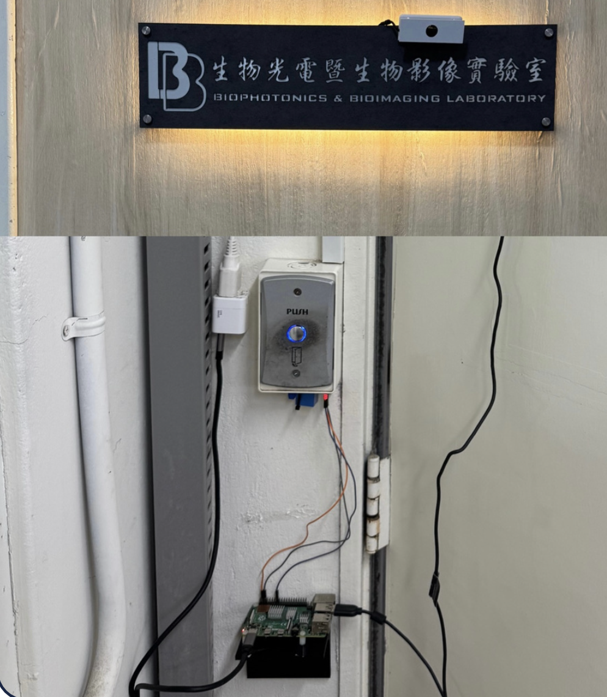

# Raspberry Pi 人臉辨識門禁系統

本專案是一個基於 **Raspberry Pi** 的智慧門禁控制系統。  
系統使用 **網路攝影機（Web Camera）** 擷取影像，透過 **YOLOv8** 進行人臉辨識，辨識成功後會觸發 **繼電器（Relay）** 控制電子門鎖開啟，實現自動化實驗室門禁。  
  
▶️ Demo 影片：[YouTube](https://youtube.com/shorts/3rbX6FRZP9A?feature=share)

---

- **硬體設備**
  - Raspberry Pi
  - USB / Web Camera
  - 繼電器模組
  - 電子門鎖（或電磁鎖）
 
    
    

- **軟體環境**
  - Python 3.9+
  - OpenCV
  - Ultralytics YOLOv8
  - RPi.GPIO

---

## 專案結構
```text
RunProject_final.py         # 主程式（人臉辨識 + 繼電器控制）
device.png                  # 硬體設備示意圖
README.md                   # 專案說明
LICENSE                     # 授權條款
